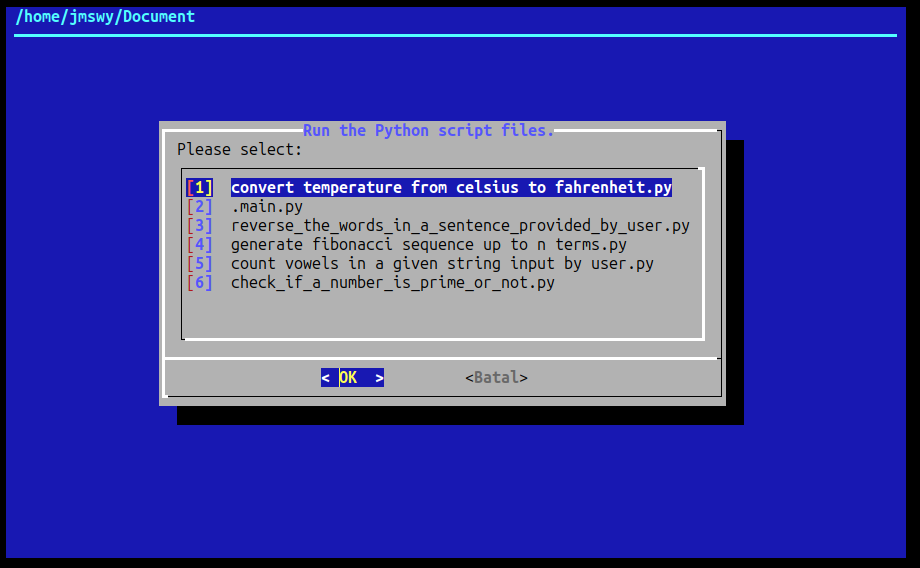

<h1 align="center">ThisPy: Run Python Scripts with a TUI  </h1>

<p align="center">
  
</p>


**ThisPy** is a simple bash tool to select and run Python files from the current directory using a **TUI (Text User Interface)** within the Terminal.
There’s no need to type or copy-paste long python filenames, keeping your clipboard free for other tasks.
Files are automatically sorted by last modified time, making it easy to access priority scripts.

---
## Quick Installation For All Linux Distros (Debian, Ubuntu, Arch, Fedora, etc.)
Follow these steps to run the installation on Terminal.

```bash
sudo curl -o /usr/local/bin/thispy https://raw.githubusercontent.com/jmswycode/thispy/main/thispy.sh && sudo chmod +x /usr/local/bin/thispy
```

Run it in the directory where the Python file is located:

```bash
thispy
```
<details>
<summary>📦 <ins>Make sure you have installed (Optional).<ins></summary>
  
#### Debian/Ubuntu
```bash
sudo apt install curl dialog
```

#### Fedora/RHEL
```bash
sudo dnf install curl dialog
```

#### Arch Linux/Manjaro
```bash
sudo pacman -S curl dialog
```

#### OpenSUSE
```bash
sudo zypper install curl dialog
```

</details>

---
&nbsp;

## For Termux (Android)
Follow these steps to run the installation on Terminal.

```bash
pkg upgrade -y && pkg install curl dialog -y
```

```bash
curl -o $PREFIX/bin/thispy https://raw.githubusercontent.com/jmswycode/thispy/main/thispy.sh && chmod +x $PREFIX/bin/thispy
```

Run it in the directory where the Python file is located:

```bash
thispy
```

---
## ⚙️ Dependencies

* `bash`
* `curl`
* `dialog`
---
